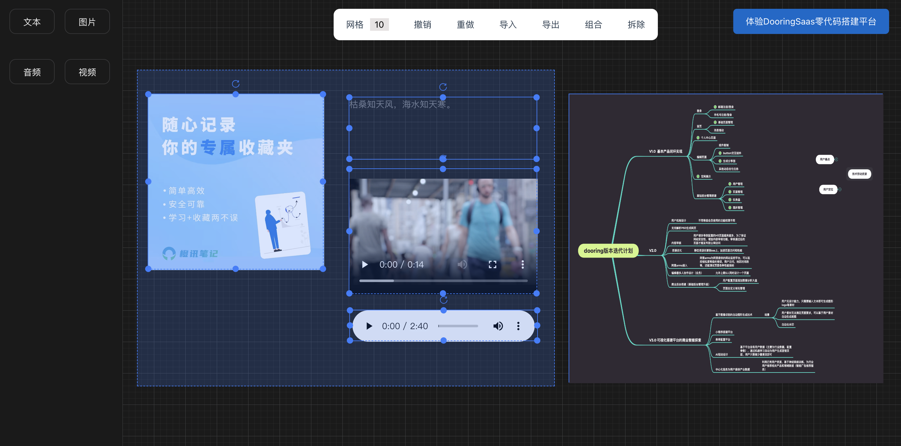

<h1 align="center">vue3-drag-demo 👋</h1>
<p align="center">
  
  <a href="#" target="_blank">
    
  </a>
</p>



> 可视化拖拽Demo, 支持参考线, 吸附, 全选, 合并, 撤销重做等  | Visual drag-and-drop demo, support guides, snapping, select all, merge, undo redo, etc.

### 🏠 [线上体验 | demo](https://dooring.vip/drag_demo)

### Features
- [x] 基础组件 Foundation Components
- [x] 组件控制器, 支持删除, 控制句柄, 旋转, 元素多选 Component controller, support for deletion, control handle, rotation, element multi-selection
- [x] 上传图片 Upload an image
- [x] 参考线 Guides
- [x] 全选, 批量移动 Select all, move in bulk
- [x] 撤销重做 Undo the redo
- [x] 元素组合 element combination
- [x] 导入 / 导出json Import/export JSON


本项目基于 `es-drager` 封装, 仅供参考学习. 如果想学习或者体验更多低代码零代码设计思路, 欢迎和我交流沟通, 也可以体验如下项目, 为你的设计提供灵感.

This project is based on the 'es-drager' package, which is for reference only. If you want to learn or experience more low-code zero-code design ideas, welcome to communicate with me, and you can also experience the following projects to provide inspiration for your design.


### More Production

| name      | Description |
| ----------- | ----------- |
| [H5-Dooring](https://github.com/MrXujiang/h5-Dooring)      | 让H5制作像搭积木一样简单, 轻松搭建H5页面, H5网站, PC端网站, LowCode平台.
| [V6.Dooring](https://github.com/MrXujiang/v6.dooring.public)   | 可视化大屏解决方案, 提供一套可视化编辑引擎, 助力个人或企业轻松定制自己的可视化大屏应用.        |
| [dooring-electron-lowcode](https://github.com/MrXujiang/dooring-electron-lowcode)   | 基于electron的H5-Dooring编辑器桌面端.        |
| [PC-Dooring](https://github.com/MrXujiang/pc-Dooring)   | 网格式拖拽搭建PC端页面.        |
| [DooringSaas](https://dooring.vip)   | 快速高效搭建可视化搭建Saas平台.        |


## Install

```sh
yarn install
```

## Usage

```sh
yarn dev
```

## Author

👤 **徐小夕**

* Website for demo: https://dooring.vip/drag_demo
* Github: [MrXujiang](https://github.com/MrXujiang)

## Show your support

Give a ⭐️ if this project helped you!


## 技术反馈和交流群 | Technical feedback and communication
微信：beautifulFront


